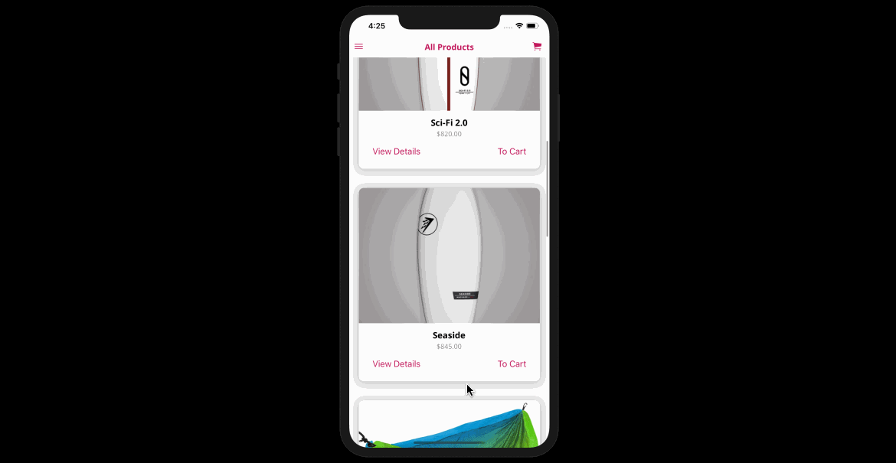

# BelezaPura

BelezaPura is a React Native mobile application that allows users to shop for and sell surfing products.



## Getting Started

#### Setup

1. Navigate to the preferred local directory where your project will reside.

2. Clone the following repository:
```
https://github.com/bee-squared/BelezaPura
```

3. Navigate inside the root directory of the project './BelezaPura/'

4. Run the following commands:
```
$ expo install
```

For iOS:
```
$ expo start --ios
```

For Android:
First Open an Android Emulator
```
$ expo start --Android
```

## Built With

- React Native
- Expo
- Redux
- React Redux

## Authors

Brian Bouchard
- [Github Profile](https://github.com/bee-squared)
- [LinkedIn Profile](https://www.linkedin.com/in/brian-bouchard)
- [Project Portfolio](https://www.b-squared.life)